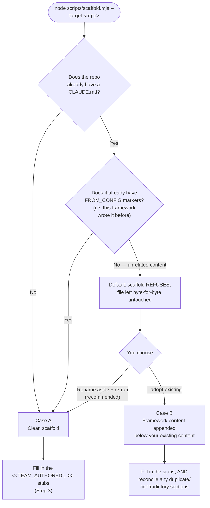

# Onboarding a New Team

This is the "adopt this in a day" guide. It walks through onboarding a
mobile team end-to-end — both the Android/Gradle side and the iOS/Xcode
side, since "mobile team" usually means both — but every step generalizes
to any stack. If you're onboarding a web or backend team, use
`--template node-pnpm` (Node/TypeScript) or `--template php-laravel`
(PHP/Laravel) instead and skip the platform-specific asides.

## Distribution Model

This framework is distributed as a **vendored scaffolder**, not an npm
package: teams clone/checkout `ai-sdlc-framework` itself and run
`node scripts/scaffold.mjs --target <their-repo>` from inside it. There
is no `npm install ai-sdlc-framework` step, and a consuming repo never
takes this framework repo on as a runtime dependency — the scaffolder
only ever *copies* files out of it. Keep that model in mind if you're
scripting adoption across many teams (e.g. a CI job that checks out this
repo fresh and scaffolds N target repos in a loop) rather than trying to
publish this as a package.

## Prerequisites

- Node.js (any recent LTS) — required for `scripts/validate-config.mjs`
  and every `hooks/lib/*.mjs` helper, **even if your repo is otherwise
  pure Gradle/Kotlin or Xcode/Swift with no other Node dependency**. This
  is a real, known adoption cost for non-Node stacks — see
  `docs/CONFORMANCE.md` for why it exists and what the alternative would
  cost.
- A checkout of this framework repo (`ai-sdlc-framework`) somewhere on
  your machine — the scaffolder is run FROM it, targeting your repo.
- Your repo initialized as a git repo (the scaffolder doesn't require
  this, but the framework's separation-of-duties guarantees assume normal
  git usage downstream).
- The GitHub CLI (`gh`), authenticated (`gh auth login`) — the
  Coordinator opens the single per-unit-of-work PR (mandate step 7 in
  `agents/coordinator.md`) via `gh`. Without it, the pipeline runs right
  up to the PR step and then stalls there. `gh pr create` is a remote
  operation, so like `git push`/`git commit` it lands under
  `permissions.ask_cmd_patterns` — expect a human approval click when the
  Coordinator opens the PR. Every PR is labeled with each entry in
  `pull_request.required_labels` (the org-wide `ai-assisted` marker is
  mandatory and enforced by `validate-config.mjs`). Create these labels in
  the GitHub repo once during setup — `gh label create ai-assisted
  --description "Opened via the AI-SDLC framework" --color 5319E7` — so the
  first PR doesn't stall on a missing label (the Coordinator will also
  create a missing label on the fly, but pre-creating it keeps the color/
  description consistent across the repo).

## Step 1 — Run the scaffolder

From the framework repo, targeting your repo:

```sh
node scripts/scaffold.mjs --target /path/to/your-mobile-android-repo --template gradle-kotlin
node scripts/scaffold.mjs --target /path/to/your-mobile-ios-repo --template xcode-swift
```

(Run once per repo — if Android and iOS are separate repos, as is
typical, scaffold each independently. If they're one monorepo, pick
whichever template matches more of the repo and hand-adjust the other
half's globs afterward.)

What happens next depends on one thing: **does this repo already have a
`CLAUDE.md`?**



### Case A — the repo has no `CLAUDE.md` yet (the common case)

This is the path above whenever a `CLAUDE.md` didn't already exist, or the
one that did was already this framework's own output. The scaffolder:

1. Vendors `agents/`, `hooks/`, `lib/ticket-source/`, the
   `repo-guide-draft` and `session-handoff` skills, and the spec/ADR
   templates into `.claude/` and `ADR/` in your repo.
2. Writes a starter `project.config.yml` (only if one doesn't already
   exist — it will never overwrite yours on a second run).
3. Writes a starter `CHANGELOG.md` (same one-time-only treatment as
   `project.config.yml`) and adds a `repomix` entry to `.mcp.json`'s
   `mcpServers` (creating the file if it doesn't exist; never overwrites a
   server already there, including your own `repomix` entry if you've
   customized it) — see "Changelog and Repomix MCP" below.
4. Installs `js-yaml`/`ajv`/`minimatch` (`npm install`) so the tooling
   actually runs.
5. Validates the config and generates `CLAUDE.md`, `REVIEW.md`, and
   `.claude/settings.json` from it, with `FROM_CONFIG` markers intact so
   every later re-run can refresh them cleanly.
6. Prints every `<<TEAM_AUTHORED:...>>` stub still waiting on a human.

Nothing further to reconcile — go to Step 2.

### Case B — the repo already has a `CLAUDE.md` with unrelated content

If your team already uses Claude Code for something else, `CLAUDE.md`
might already exist and have nothing to do with this framework. By
default the scaffolder **refuses** rather than silently discarding it or
silently generating a `CLAUDE.md` with none of the framework's governance
content — you'll see a message like:

```
scaffold: CLAUDE.md already exists with no FROM_CONFIG markers — it
doesn't look like framework-generated output. Refusing to modify it
silently.
```

You have two ways forward, and they lead to different end states:

| | Rename aside + re-run (recommended) | `--adopt-existing` |
| --- | --- | --- |
| **Command** | `mv CLAUDE.md CLAUDE.pre-ai-sdlc-framework.md`, then re-run scaffold | re-run scaffold with `--adopt-existing` |
| **Result** | One coherent, canonical `CLAUDE.md` (Case A) — you manually port real content back into it | One file: your original content, then a delimiter, then the framework's content appended below it |
| **Effort** | More upfront (manual porting) | Less upfront, but you'll likely have duplicate section headings (e.g. two `## Coding Conventions`) to clean up by hand |
| **When to pick it** | Your existing `CLAUDE.md` is thin, or you want one clean file | Your existing `CLAUDE.md` is substantial and worth preserving verbatim |

Either way, nothing existing is ever deleted — the worst case is a
`.pre-ai-sdlc-framework.md` copy sitting next to the new file, or two
sections with the same heading in one file, both easy to spot and clean
up. See `docs/CONFORMANCE.md` Section B items 6–8 and Section D for the
full behavior and its documented limits.

**The same applies to a pre-existing `.claude/agents/*.md`, `.claude/hooks/*`,
and `.claude/settings.json`** — handled automatically, not something you
need to prepare for. A vendored file that differs from what we'd write is
moved aside (never deleted), not overwritten. A pre-existing
`.claude/settings.json` is merged: anything it has that
`project.config.yml` can't express lands in `.claude/settings.local.json`,
which this scaffolder never touches again.

### Changelog and Repomix MCP

Every scaffold run also does a few small, additive things at the target's
root, none gated on `isFirstAdoption`:

- **`CHANGELOG.md`** — written from `templates/CHANGELOG.template.md` only
  if one doesn't already exist, then never touched again by this
  scaffolder (same treatment as `project.config.yml` — everything after
  the first write is real history).
- **`changelog.d/`** — vendored with its own `README.md` explaining the
  fragment-file convention. Rather than editing `CHANGELOG.md` directly,
  the Coordinator creates one file per completed unit of work,
  `changelog.d/<ticket-id>.<category>.md` (`category` is one of Keep a
  Changelog's buckets — `added`/`changed`/`deprecated`/`removed`/`fixed`/
  `security`), before opening each PR (`agents/coordinator.md` mandate
  step 7). This is deliberately NOT a shared "append here" section:
  multiple branches in flight at once would all be inserting text at the
  same anchor point in the same file, which is exactly the kind of change
  git's merge algorithm conflicts on most often. One file per unit of
  work means two branches never touch the same file, so they never
  conflict regardless of which one merges first, and a slow-to-merge
  branch's fragment simply rolls into whichever release cut happens after
  it lands — no manual reconciliation needed.
- At release time, `scripts/cut-changelog-release.mjs` reads every
  fragment in `changelog.d/`, groups them by category, writes a new dated
  section into `CHANGELOG.md`, and deletes the fragments it consumed. Run
  it by hand, or scaffold with `--with-release` to vendor
  `.github/workflows/ai-sdlc-release.yml`, which runs it automatically on
  a version tag push (`v*`) and opens a PR with the result rather than
  pushing straight to your default branch — see that workflow file's own
  header comment for why.
- **`.mcp.json`** — a `repomix` entry is added to `mcpServers` (creating
  the file if it doesn't exist yet) so the Coordinator can pack this or
  another repo into AI-friendly context on demand
  (`npx -y repomix --mcp`, exposing `pack_codebase`/
  `pack_remote_repository`/`read_repomix_output`/`grep_repomix_output`) —
  useful during initial adoption of a large or unfamiliar codebase, or any
  time delegating a broad "where does X live" question to a fresh
  Implementor/Verifier subagent would otherwise cost a lot of exploratory
  tool calls. Only added if that key isn't already present — a team's own
  `repomix` configuration, or any other MCP server already listed, is
  never touched. Edit or delete the entry in `.mcp.json` if you don't want
  it. Being connected doesn't make it self-triggering — `agents/coordinator.md`
  mandate step 3 names it explicitly as something to consider while
  writing a spec's Execution Flow/Function Calls/Impact Radius sections,
  which is what actually makes the Coordinator reach for it.

### The `repo-guide-draft` skill

Vendored to `.claude/skills/repo-guide-draft/SKILL.md`, invoked explicitly
(`/repo-guide-draft`) — not run automatically by anything. It uses the
`repomix` MCP server to scan the repo and writes `docs/AI-GUIDE-DRAFT.md`:
a standalone, one-time draft covering stack, structure, conventions,
test/check commands, and **proposed** (not applied) deny/ask/allow
permission entries, structured so a developer can copy pieces of it
straight into `CLAUDE.md`'s `TEAM_AUTHORED` stubs, `REVIEW.md`, and
`project.config.yml`'s `permissions` block.

This is deliberately a one-shot drafting aid, not a synced artifact —
nothing in this framework reads `docs/AI-GUIDE-DRAFT.md` back, and the
skill refuses to overwrite it if it already exists (same treatment as
`project.config.yml`/`CHANGELOG.md`): move the old draft aside by hand if
you want a fresh one. Most useful right after first adopting this
framework into a repo you didn't build yourself, when the
`TEAM_AUTHORED` stubs and the permissions block are otherwise a blank
page.

### The `session-handoff` skill and its `SessionStart` hook

Vendored to `.claude/skills/session-handoff/SKILL.md`, invoked explicitly
(`/session-handoff`) — for when you notice context usage climbing
(`/context`) mid-task and would rather hand off deliberately than let
Claude Code's auto-compaction summarize the session lossily. It writes
`.claude/hooks/.state/HANDOFF.md`: active spec, tier, done/pending
status, files touched, and anything decided this session that isn't yet
written into a spec or ADR — the one category of information a fresh
session-start really would lose otherwise.

Unlike `repo-guide-draft`, this file is **always overwritten**, not a
one-shot draft — it's a living "current state" snapshot, useful only
until the task moves past it. It's also local-only:
`.claude/hooks/.state/` is already gitignored, so two developers' handoff
notes never collide.

The other half is `hooks/session-start-handoff.mjs`, wired into
`.claude/settings.json`'s `SessionStart` hooks automatically (no flag
needed) — it surfaces `HANDOFF.md`'s content into a fresh session on its
own, so nobody has to manually paste it in. It never deletes the file
itself (`SessionStart` also fires on `/clear`/`/compact`, not only a
genuinely new session); once a session has read a surfaced note and
either continued the task or confirmed it's done, delete
`.claude/hooks/.state/HANDOFF.md` yourself so a future session doesn't
trip over a stale one.

## Step 2 — Edit `project.config.yml`

The starter config has `CHANGE_ME` placeholders — replace all of them.
For the Android repo, that's things like:

```yaml
team:
  name: "mobile-android-engineering"
  git_remote: "git@github.com:enterprise/mobile-android.git"
tiers:
  C_needs_reviewer: "mobile-android-architecture-team"
```

Two things the starter template already gets right, worth pointing out
explicitly since they're easy to accidentally weaken:

- **Secrets stay denied by default.** `permissions.deny_read` already
  includes `**/*.keystore`, `**/*.p12`, `**/secrets/**`, `.env*` for
  Android (and `**/*.p12`, `**/*.mobileprovision` for iOS). Don't narrow
  this list without a specific reason, and if you add a new secret file
  type this repo uses, add it here.
- **A public API contract change is already a Tier D trigger.** Both
  starter templates ship `"public API contract change"` in
  `tiers.D_triggers` — meaning an agent hits a hard stop and requires an
  approved ADR before touching a public API shape, on day one, without
  you having to remember to add it.

Re-run the scaffolder after editing the config — it's idempotent (see
`templates/CLAUDE.template.md`'s marker convention) and will refresh
`CLAUDE.md`/`REVIEW.md`/`settings.json` without touching anything you've
since written by hand:

```sh
node scripts/scaffold.mjs --target /path/to/your-mobile-android-repo
```

(No `--template` needed once `project.config.yml` exists.)

## Step 3 — Fill in `CLAUDE.md`'s `TEAM_AUTHORED` sections

The scaffolder's final output lists exactly which lines still need a
human. At minimum, write:

- **Architecture Overview** — for Android, this is where you'd note e.g.
  "single-module app, MVVM, Hilt for DI." For iOS, "SwiftUI + Composable
  Architecture" or whatever actually applies. The framework has no
  opinion here on purpose.
- **Escalation Contacts** — who gets paged on a Tier D/E stop. Don't
  leave this blank; an agent halting on Tier D needs to know who to tell.

**If you went through Case B with `--adopt-existing`** (Step 1), do one
more thing here: read the whole file once and delete any now-duplicate
section — your original content likely already covers some of the
`<<TEAM_AUTHORED:...>>` topics above (e.g. an existing "Architecture"
section makes the appended, empty "Architecture Overview" stub
redundant). This framework won't do that reconciliation for you.

## Step 4 — Know how git/PR operations are gated

This framework's standing deployment model launches Implementor and
Verifier as **in-process Task-tool subagents sharing the Coordinator's
own session settings** — not as separate headless `claude -p`
invocations. That's a deliberate choice, not a per-team decision to make;
don't try to run a repo in the separate-process model instead.

The consequence: no hook or permission rule can tell "the Coordinator's
Bash call" apart from "the Implementor's Bash call" when all three share
one settings scope. So the framework doesn't try to — instead, every
state-changing git/PR operation (`git commit`, `git push`, `gh pr create`)
is in `permissions.ask_cmd_patterns`, meaning **each one stops for a human
approval click regardless of which agent initiates it**. A human in the
loop for every state change is the separation-of-duties guarantee here.
Don't remove any of those three from `ask_cmd_patterns` thinking they're
redundant — they *are* the mechanism.

(The framework also vendors `hooks/implementor-git-guard.sh`, a
PreToolUse hard-block git-guard, but it is **not wired into
`.claude/settings.json`** by default — the human-approval gate above makes
it redundant in the shared-session model. It stays available for teams who
run the separate-process model and want a true hard block scoped to the
Implementor/Verifier contexts; see `docs/CONFORMANCE.md` item B.1.)

## Step 5 — Wire (or defer) the ticket source

`project.config.yml`'s `ticket_source.type` defaults to `"manual"` in
every starter template — the Coordinator asks a human to paste ticket
text, every time, until you configure otherwise. This is a safe, fully
functional default; wiring an MCP connector is an optimization you can
do later, not a blocker to starting.

To wire one: see `lib/ticket-source/adapters/mcp.md` for the generic
contract, or `lib/ticket-source/adapters/zoho.md` for a concrete worked
example if your team uses Zoho Sprints. Update `ticket_source` in
`project.config.yml` accordingly and re-run the scaffolder.

## Step 6 — Run a first task

1. Give the Coordinator a ticket reference (or paste one, if using the
   manual adapter).
2. It should write `docs/specs/<feature>.md` (check it against
   `templates/SPEC.template.md`'s shape) and classify a tier.
3. It delegates to the Implementor, which writes code +
   `verify_hook.include_glob`-matching tests; `hooks/verify-loop.sh`
   should fire automatically after each edit.
4. It delegates to the Verifier, which re-runs `stack.lint_cmd` /
   `stack.test_cmd` and returns PASS/FAIL.
5. On PASS, the Coordinator commits. On FAIL, it re-delegates with the
   Verifier's report.

If step 3's hook never seems to fire, revisit Step 4 above before assuming
something else is broken. On step 5, expect a human-approval prompt on the
commit (and again on `git push` / `gh pr create`) — that prompt is the
gate working as designed, not an error.

## Common Early Friction

- **"Why does my pure-Gradle repo need `package.json`/`node_modules`?"**
  See the Prerequisites note above and `docs/CONFORMANCE.md`.
- **A file gets blocked repeatedly by `verify-loop.sh`.** After
  `verify_hook.loop_budget` consecutive failures (default 3), blocking
  stops and the file is logged to
  `.claude/hooks/.state/needs-human-review.log` instead — check there.
- **A commit / push / PR keeps prompting for approval.** That's the
  separation-of-duties gate (Step 4): `git commit`, `git push`, and
  `gh pr create` are in `permissions.ask_cmd_patterns` and require a human
  click every time, by design. If you want a *harder* block that also
  stops the Implementor from even attempting other git writes, that's the
  optional `hooks/implementor-git-guard.sh` hard-block hook — not wired by
  default; see `docs/CONFORMANCE.md` item B.1 for when to enable it.
